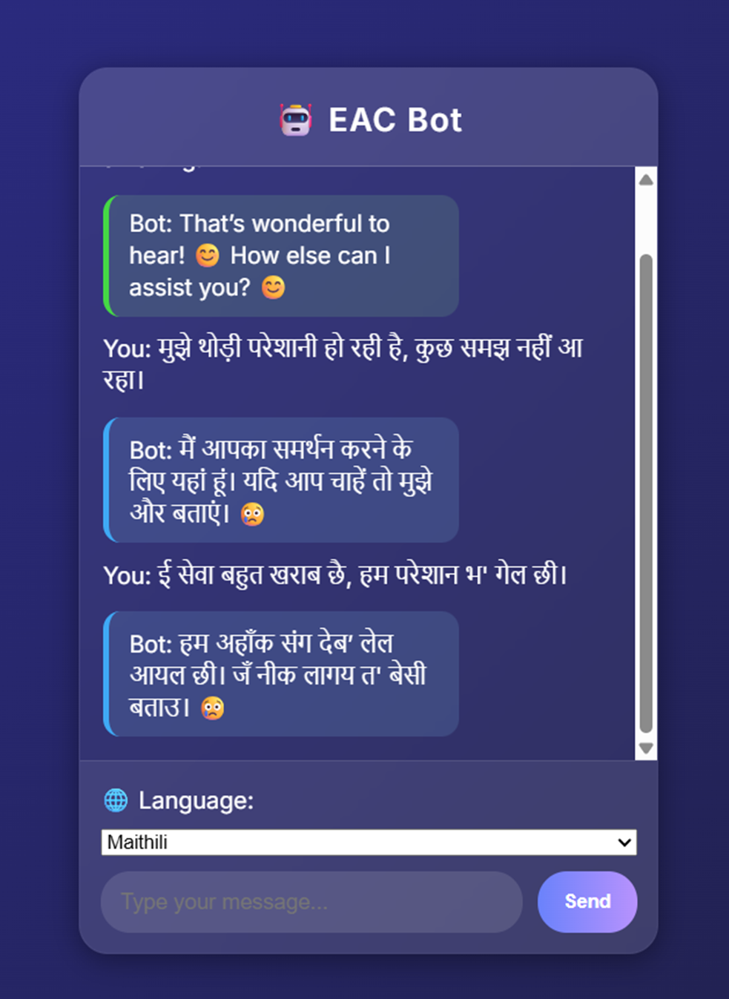

# EAC-bot
# 🤖 EAC Bot – Emotion-Aware Chat Assistant

> **"Empathy in Every Reply"**  
> A multilingual chatbot that understands your emotions and replies accordingly — now with support for English, Hindi, and Maithili!

---

## 🌟 Project Overview

EAC Bot is an intelligent chatbot built to enhance customer support experiences by detecting the **user's emotion from their text** and responding with **empathetic, emotion-aware replies**. It supports multiple languages and automatically adjusts its tone and response based on how the user is feeling.

---

## 🧠 Features

- 😊 Emotion Detection (Happy, Sad, Angry, Neutral)
- 🌐 Multilingual Support (English, Hindi, Maithili)
- 🧾 Emotion-Based Chat Styling with Emojis
- 🧠 Sentiment Analysis using **TextBlob**
- 🔄 Auto-Translation using **deep-translator**
- ⚠️ Escalates angry users to a human assistant
- 💾 Logs chats for emotional analytics
- 🖥️ Responsive UI using HTML, CSS & JS
- 🚀 Deployed using Render

---

## Demo

🌍 Live Demo:   https://eac-bot.onrender.com/
📦 GitHub Repo: https://github.com/Adityaraj-star/EAC-bot

---

## Tech Stack

| Layer | Technologies |
|-------|--------------|
| 💻 Frontend | HTML, CSS, JavaScript |
| 🧠 Backend | Python, Flask |
| 🧪 Emotion Engine | TextBlob |
| 🌍 Translation | deep-translator |
| 🌐 Deployment | Render |
| 📝 Chat Logs | Text File Logging (`chat_logs.txt`) |

---

## 🔁 How It Works

1. User types a message in **any of the supported languages**
2. Bot translates message to English (if needed)
3. **TextBlob** analyzes the emotional polarity
4. Based on emotion, bot selects a relevant reply and emoji
5. Bot translates reply back to user's language
6. **If angry**, bot escalates to a human agent
7. Full chat is stored in a log file for analysis

---

## 🖼 UI Highlights

- 🌐 Language dropdown for user input
- ⏳ Typing animation for bot realism
- 🎨 Emotion-colored bot messages (green, red, blue, gray)
- 📷 Screenshots in `/screenshots` folder *(add yours)*

---

Made with ❤️ by Aditya Raj
